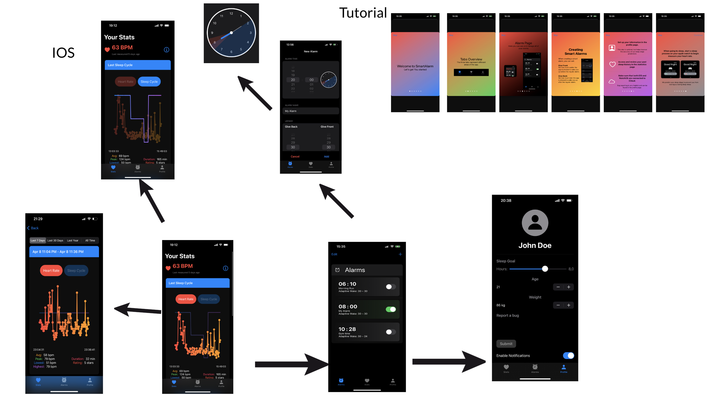
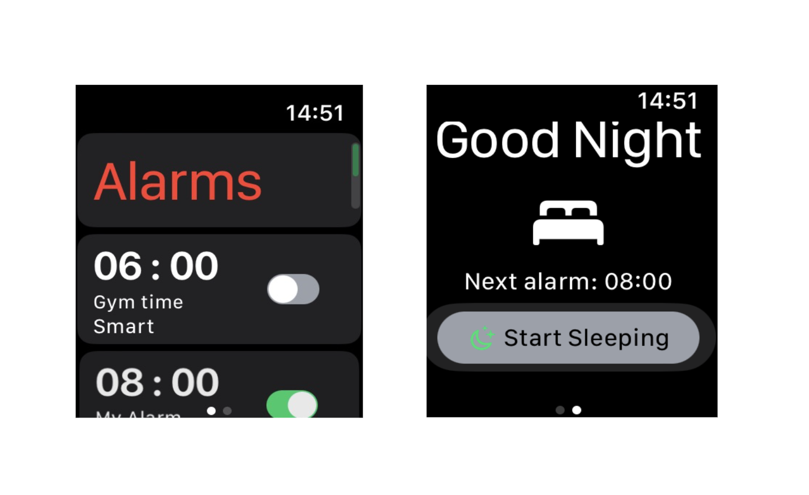

# LokaverkefniSmartAlarm
This repository contains the code, documentation, and other relevant resources for the Smart Alarm Sleep App


## Table of Contents

- [Introduction](#Introduction)
- [Code Architecture](#code-rchitecture)
- [Example Of Sleeping Proccess](#example-proccess)

## Introduction

This project is the result of our research study aimed at improving the quality of sleep for individuals by preventing users from waking up during a deeper stage of sleep. This is acheived by leveraging the power of machine learning.

The Smart Alarm Sleep App is not your average alarm clock. Rather than setting a specific time to wake up, users provide a window during which they would like to wake up. Using heart rate data collected throughout the night, the app predicts the user's sleep stages and attempts to wake them up during a period of light sleep within the selected window. The goal of this approach is to minimize sleep inertia, the feeling of grogginess and disorientation that can come from being awakened during deep sleep.

The heart of our application lies in its machine learning model, which we trained to predict sleep stages based on heart rate data. This repository contains all the code used for developing the app, from data preprocessing and model training to the final application that users interact with.


# Code Architecture

Our application structure is divided into three main directories: `API`, `SleepPrediction`, and `Xcode Project`. Each directory has a distinct role in the overall functionality of the Smart Alarm Sleep App. Below, we provide an overview of what each directory contains and how it contributes to the app.

## Xcode Project
The `Xcode Project` directory contains the source code for the iOS and watchOS applications. These are developed using Xcode, Apple's integrated development environment (IDE). The applications serve as the user interface for the Smart Alarm Sleep App, allowing users to input their desired wake-up window and view their sleep data. 

Here is how the applications look:
IOS Application: 
<p align="center">
  
</p>
watchOS Application: 
<p align="center">
  
</p>

## API
The `API` directory contains the code for the application programming interface (API) that handles the communication between the Apple Watch and the server. The Apple Watch records the user's heart rate and sends it to the API. The API then communicates with the sleep prediction model to analyze the data and determine the optimal time within the user's wake-up window to trigger the alarm.

## SleepPrediction
The `SleepPrediction` directory contains the Python scripts used to preprocess the heart rate data and train the machine learning model for sleep stage prediction. The model is based on a deep learning architecture, specifically a Neural Network, and is trained on a dataset of heart rate data and corresponding sleep stages. The details of the model's setup and the training process can be found in our research paper. Once trained, this model is used by the API to analyze incoming heart rate data and predict the user's sleep stage.

# Sleep Process and Data Prediction

When the user initiates the sleep process by pressing the "Start Sleeping" button on their Apple Watch, it triggers a workout process on the watch and simultaneously sends the user's most recent heart rate data to the API endpoint `@app.route('/predict', methods=['POST'])`.

Within the API endpoint, the received heart rate data is temporarily stored, and the sleep stages the user is going through are predicted using the following line of code:

```python
pred = transformdata([f"{s},{int(h)}" for s,h in zip(time_list, heart_rates)])
```

It's important to note that the data is preprocessed before feeding it into the model. The `transformdata()` function is responsible for both data augmentation and data transformation. For detailed information on the preprocessing techniques utilized, please refer to the research paper.

The `pred` variable obtained from the prediction is then used to find an optimal wake-up time based on the user's preferences and defined rules. The following line of code is used for this purpose:

```python
newAlarm = find_optimal_wakeup(pred, time_list, alarm, giveFront*60, giveBack*60)
```

By utilizing the predicted sleep stages, the original alarm time, and the user-defined rules, the `find_optimal_wakeup()` function determines a new alarm time that aims to minimize sleep inertia or grogginess upon awakening.

This process demonstrates how the user's heart rate data is collected, processed, and used to predict sleep stages, ultimately leading to the calculation of an optimized wake-up time based on the user's preferences.

